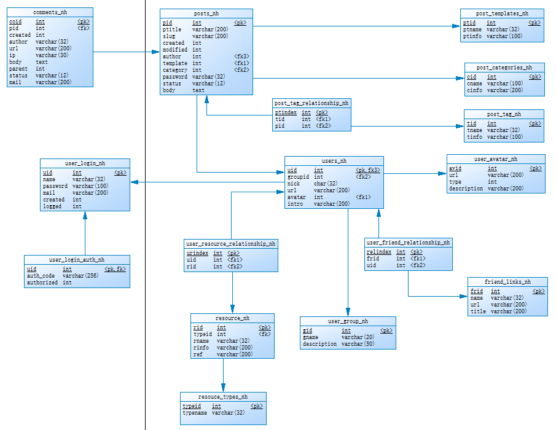

# Blog Server

Code for my blog server
博客服务器代码

## Technical Stacks

- Go
- MySQL

## Storage

Currently I use mysql database.

Plan to use no-sql database for comments.

Still working on for the whole functionality.

Currently only finish the post and user modules.



## Current Version

0.0.1 (2017.12.25)

## Build

- create a `my-config.go` file under `src` folder, note that `NEKOHAND_DATABASE_ADDR` is not effective, by default using **12450** port for API

```go
    package main
    
    import "os"
    
    func configuration () {
    	os.Setenv("NEKOHAND_ADMINISTRATOR","database user")
    	os.Setenv("NEKOHAND_PASSWORD", "database password")
    	os.Setenv("NEKOHAND_DATABASE_NAME", "database name")
    	os.Setenv("NEKOHAND_DATABASE_ADDR", "api port(currently has no effect)")
    	os.Setenv("NEKOHAND_AUTHORIZATION", "authcode")
    }
```
- run `go build .` and `./src` to start.

## Dependencies

run `go get` for the below packages.

- github.com/gorilla/mux
- github.com/dgrijalva/jwt-go
- github.com/rs/cors
- github.com/codegangsta/negroni
- gopkg.in/russross/blackfriday.v2
    
## License

GPL v3.0